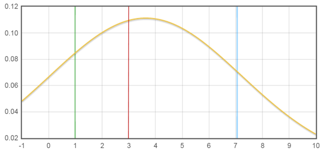
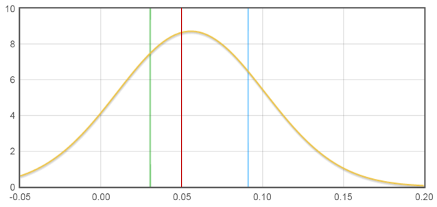

## Examples

### Elicitation of expert opinion on differences between LSAC non-respondents and respondents

#### Example of the elicitation questionnaire

__Questionnaire on differences between LSAC non-respondents and respondents__

__Research objective__

The purpose of our research is to evaluate a statistical approach called the “delta-adjustment method” that can be used for performing sensitivity analyses within the multiple imputation framework. In particular, we aim to assess this method after implementing the standard multiple imputation procedure for handling missing data, and explore the robustness of inference of the estimated exposure-outcome associations to the scenario where the missing values of a data variable depend on that variable (e.g. mothers are less likely to complete the questions on maternal emotional distress if their levels of distress are high).

__Missing data in Longitudinal Study of Australian Children (LSAC)__

Non-response is a problem in the LSAC dataset with missing observations on multiple waves. Our case study uses data from the LSAC kindergarten cohort including waves 1 (4-5 years) and 3 (8-9 years). The percentage of missing observations across variables ranged from 0% to 24%.

The aim of our case study is to estimate the association between maternal emotional distress at pre-school aged children (4-5 years) and the middle childhood behaviour (8-9 years), controlling for potential confounders. We use multiple imputation (MI) to deal with the missing data. MI may produce biased results if participants with missing observations are systematically different from the participants with observed data, and these differences cannot be explained by the observed data alone. Thus, it is desirable to conduct a sensitivity analysis to allow for systematic differences between non-respondents and respondents.

__Plan__

We wish to use the delta-adjustment method within the MI framework for conducting sensitivity analyses, and in order to do this we need prior information on the magnitude of the systematic differences between participants with incomplete and complete data. These magnitudes are unidentifiable in practice and cannot be estimated from the observed data. The only principled way to obtain these unknown quantities is to elicit a range of plausible values from subject-matter experts. 

__Outline of elicitation task__

We are interested in the average systematic differences in the total child difficulties (SDQ total score) at 8-9 years, and the proportion of mothers with emotional distress at 4-5 years, between non-respondents and respondents. 

Naturally you are not sure, what would be a shift in the mean SDQ total score at 8-9 years or what would be a shift in the proportion of the maternal emotional distress at 4-5 years between the non-respondents and respondents in the study population. However, you might feel that some differences are more plausible than others. 

In the next section, we kindly ask you to provide a median value, upper and lower quartiles with minimum and maximum values for the distribution of average change in the SDQ total score at 8-9 years as well as the proportion of maternal emotional distress at 4-5 years, between LSAC participants with missing and observed data.

__Characteristics of SDQ total score at 8-9 years__

The outcome variable is “SDQ total score” at 8-9 years as assessed by social and emotional subscales of the Strengths and Difficulties Questionnaire (SDQ). The SDQ total difficulties score is summed over four subscales relating to conduct, hyperactivity, peer, and emotional problems, with a minimum possible score of 0 and a maximum possible score of 40. Each of these subscales is averaged over five items, where 1 is the minimum score for an answer (Not true), and 3 is the maximum score (Certainly true). These mean values are rescaled to be an integer between 0 and 10. The lower SDQ total score corresponds to a better child’s overall behaviour status.

__Table 1.__ Distribution of SDQ total score for LSAC participants who responded to the questionnaire in waves 1 (4-5 years) and 3 (8-9 years).

What is your expectation about the average differences in the SDQ total score at 8-9 years between LSAC participants with missing and observed data? Please complete Table 2 below (an explanation of the hypothetical example is provided on the next page).

__Table 2.__ Elicitation of prior information for the distribution of the mean difference in the SDQ total score at 8-9 years between LSAC non-respondents and respondents.

* Minimum – the smallest value of the mean difference.
* Maximum – the largest value of the mean difference.
* Median – a value that the mean difference is equally likely to be less than or greater than this point (the level which you believe the mean difference is most likely to lie).
* Lower & Upper quartiles – the levels between which you are 50% sure the mean difference lies.

To help you to complete Table 2, we provide an example which corresponds to a hypothetical expert who thinks that the smallest possible value (minimum) for the mean difference in the SDQ total score at 8-9 years is -1 (i.e. the mean SDQ total score at 8-9 years in respondents is higher by one unit than non-respondents) and the maximum possible value is 10 units (i.e. the mean SDQ total score at 8-9 years in non-respondents is higher by 10 units than respondents). She believes that the distribution of the mean difference has a median (red line) of 3 units (i.e. 50% sure that the mean SDQ total score at 8-9 years in non-respondents is higher by 3 units than respondents), with lower (green line) and upper (blue line) quartiles of 1 and 7 units (i.e. 50% sure that the mean SDQ total score at 8-9 years in non-respondents is higher by 1 up to 7 units than respondents), respectively. 

Figure 1 illustrates the expert’s probability distribution function for the mean difference in the SDQ total score at 8-9 years between LSAC non-respondents and respondents. The values are also given in Table 2.

__Characteristics of maternal emotional distress at 4-5 years__

The primary exposure of interest is mother’s emotional distress at 4-5 years, measured by Kessler-6 (K-6) depression scale ranged between 1 – 5 and averaged over six items about a person’s anxiety and depression symptoms in the most recent four weeks. Since the distribution of mother’s emotional distress was left-skewed, with the bulk of the observations on the higher scores (i.e. 4 – 5), we dichotomised this variable for the purpose of our case study such that 1 represents a category with “probable serious mental illness” (i.e. average K-6 score less than 4), and 0 represents a category with “no probable serious mental illness” (i.e. average K-6 score greater or equal to 4). The higher averaged score represents the better mother’s mental status.

__Table 3.__ Distribution of maternal emotional distress for LSAC participants who responded to the questionnaire at 4-5 years (4164 out of 4983).

What is your expectation for the average shift in the proportion of mothers who were emotionally distressed at 4-5 years between LSAC non-respondents and respondents? Please complete Table 4 below (an explanation of the hypothetical example is provided on the next page).

__Table 4.__ Elicitation of prior information for the distribution of average shift in proportion of mothers who were emotionally distressed at 4-5 years between LSAC non-respondents and respondents.

* Minimum – the smallest value of the average shift in the proportion.
* Maximum – the largest value of the average shift in the proportion.
* Median – a value that the average shift in the proportion is equally likely to be less than or greater than this point (the level which you believe the shift is most likely to be.
* Lower & Upper quartiles – the levels between which you are 50% sure the average shift in the proportion lies.

To help you to complete Table 4, we provide an example which corresponds to a hypothetical expert who thinks that the smallest possible value (minimum) for the average shift in the proportion is -5% (i.e. the proportion of mothers with emotional distress in respondents is higher by 5% than non-respondents) and the maximum possible value is 20% (i.e. the proportion of mothers who were emotionally distressed is higher in non-respondents by 20% than respondents). She believes that the most probable value of the average shift in the proportion between non-respondents and respondents would be 5% (median shown in red), but could be varied from 3% (lower quartile shown in green) up to 9% (upper quartile shown in blue). 

Figure 2 shows the expert’s probability distribution function for the average change in the proportion of mother’s emotional distress at 4-5 years between LSAC non-respondents and respondents. The values are also given in Table 4.

THANK YOU FOR YOUR TIME AND HELP